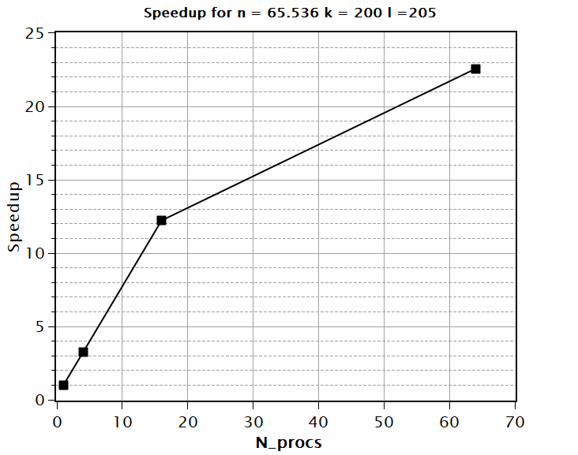

# Parallel Randomized Nyström for low-rank approximation

> Author: Erik Fabrizzi

> Course: High performance computing for numerical methods and data analysis

## Introduction

The goal of this project is to demonstrate the Nyström method for low-rank approximation of large positive semi-definite matrices (**PSD**) and it's implementation on distributed systems with the aid of MPI. In particular the *block sub-sampled randomized Hadamard transformation* (**BSRHT**) will be employed as sketching technique for the implementation and the accuracy of this approach will be compared to the classic Gaussian sketching method. An overview of performance will be given.

## Theoretical Background

In this section we will give a brief introduction to *sketching*, the Nyström approximation and its truncation to rank $k$.

### Random sketching

The goal of sketching is to find an embedding of a high dimensional subspace into a low
dimensional one, while preserving some geometry, with high probability. In this project we are 
interested in sketching by means of *oblivious* $\ell2$-*subspace embeddings* (**OSE**), which are defined by
the following property [**1**]:

**Definition: (OSE)** Let $0\leq \epsilon < 1$ and  $0\leq \delta < 1$. Then a random matrix $\Omega \in \mathbb{R}^{l\times m}$  is said to be a $(\epsilon,\delta,d)$ OSE if for any fixed  $d$-dimensional subspace  $V \subseteq \mathbb{R}^n$

$$
    \forall x \in V, \phantom{00} ||x||^2_2-||\Omega x||^2_2 \leq \epsilon ||x||^2_2
$$

holds with probability $1-\delta$.

Furthermore, as mentioned in the lecture [**2**],

$$
    \forall x_i,x_j \in V, \phantom{00} |\langle\Omega x_i, \Omega x_j \rangle - \langle x_i, x_j \rangle| \leq \epsilon||x_i||_2 ||x_j||_2
$$

holds with probability $1-\delta$.

In other words an OSE is a random matrix that is capable to project an higher dimensional space into a lower dimensional one with $1-\delta$ probability of preserving the angles and magnitudes of the projected space up to some tolerance $\epsilon$.

In this project 2 OSE that are well suited for parallel algorithms will be of interest:

* Gaussian sketching (Random)
* Block sub-sampled random Hadamard transform sketching

#### Gaussian sketching

It can be shown [**2**] that a matrix $\Omega \in \mathbb{R}^{m\times l}$ of random, normal, independent entries ($\mu=0, \Delta = 1$) multiplied by $1/\sqrt{l}$  is an OSE with 
$$
    l= O(\epsilon^{-2}(n+\log(1/\delta)))
$$

This sketching is well suited for parallel algorithms since, in the context of a block-row  partitioning $\Omega = [\Omega_1 \ldots \Omega_P]$ each block can be built independently by a process given that all processes in a distributed system share the same state for the random generator of choice.

#### BSRHT Sketching 

It can be shown [**1**] [**2**] that a sketching $\Omega \in \mathbb{R}^{l\times m} = [\Omega_1 \ldots \Omega_i \ldots \Omega_P]$ with
$$
    \Omega_i = \sqrt{\frac{m}{Pl}}=D_{Li}RHD_{Ri}
$$

where:

* $R \in \mathbb{R}^{l\times m}$ formed by subset of $l$ rows of the identity, chosen uniformly at random
* $H \in \mathbb{R}^{m/P\times m/P}$ is the normalized Walsh-Hadamard matrix
* $D_{Li} \in \mathbb{R}^{l\times l}$ are diagonal indipendent random signs (uniformly distributed beween -1 and 1)
* $D_{Ri} \in \mathbb{R}^{m/P\times m/P}$ are diagonal indipendent random signs (uniformly distributed beween -1 and 1)

is an OSE with :

$$
l= O(\epsilon^{-2}(n+\ln(m/\delta))\ln(n/\delta))
$$

Blocks of this sketching can be again built independently in a distributed algorithm under common state of the random generator of choice.

**Note:**  The Walsh-Hadamard matrix is recursively defined as: 

$$
    H_2 =\begin{pmatrix}
1 & 1 \\
1 & -1
\end{pmatrix}, \phantom{00}   H_m =\begin{pmatrix}
H_{m/2} & H_{m/2} \\
H_{m/2} & -H_{m/2}
\end{pmatrix}\in \mathbb{R}^{m\times m}
$$

### Nyström approximation and k-rank truncation methods

As discussed in [**2**], given a SPSD matrix $A\in \mathbb{R}^{m\times m}$ and a OSE $\Omega \in \mathbb{R}^{m \times l}$, the Nyström Approximation,

$$
    [\![A]\!]_{\text{Ny}} = (A \Omega )(\Omega^T A \Omega)^\dagger(\Omega^T A)
$$

yields an approximation of $A$ of at most rank $l$ with favorable accuracy with respect to other random approximation methods like **RSVD**.

The goal of this section is to explain how to perform a truncation of this approximation an arbitrary rank $k<l$ without performing an svd of the approximation, which is really costly for large matrices (time complexity of $O(n^3)$ for square matrices using Jacobi Rotations).

The idea is to find a decomposition strategy that yields $U,\Sigma$ such that
$$
    [\![A]\!]_{\text{Ny}} =U\Sigma U^T
$$
by maintaining a low time complexity of the algorithm. Than this can be truncated as usual to obtain
$$
    [\![A]\!]_{\text{Ny,k}} =U_k\Sigma_k U_k^T,
$$
where we keep the entries of $U$ and $\Sigma$ relevant only to the first $k$ singular values of $[\![A]\!]_{\text{Ny}}$. 

A possible method based on the eigenvalue decomposition of $B = \Omega A \Omega^T$ (rather than Cholesky Factorization [**2**]) is the following:
$$
    \text{Compute } C = A \Omega
$$
$$
    \text{Compute } B = P D P^T = P D^{ \frac{1}{2}} D^{ \frac{1}{2}} P^T = (P D^{ \frac{1}{2}})(P D^{ \frac{1}{2}})^T = LL^T
$$

Were we have used an eigenvalue decomposition to factorize $B$.

$$
    \text{Compute } Z = CL^{-T} = QR
$$

Were $Z$ shall be computed by substitution rather than by inverting $L$.

$$
    \text{Compute } R = \tilde{U}\tilde{\Sigma}\tilde{V}^T
$$

Then a truncated approximation of $[\![A]\!]_{\text{Ny}}$ can be obtained as

$$
    [\![A]\!]_{\text{Ny},k} = Q\tilde{U}_k\tilde{\Sigma}^2_k\tilde{U}_k^TQ^T = U_k\Sigma_k U_k^T.
$$

since, 

$$
    [\![A]\!]_{\text{Ny}} = (A \Omega )(\Omega^T A \Omega)^\dagger(\Omega^T A) = CB^{-1}C^T
$$
$$
    \phantom{[\![A]\!]_{\text{Ny}}} = C(LL^T)^{-1}C^T=CL^{-T}L^{-1}C^T\phantom{AA}
$$
$$
    \phantom{[\![A]\!]_{\text{Ny}}} = Q\tilde{U}\tilde{\Sigma}\tilde{V}^T\tilde{V}\tilde{\Sigma}\tilde{U}^TQ^T = Q\tilde{U}\tilde{\Sigma}^2\tilde{U}Q^T
$$
$$
    \phantom{[\![A]\!]_{\text{Ny}}} = U\Sigma U^T\phantom{AAAAAAAAAAAAAAA}
$$

### Additional note on the trace norm

For a given SPSD matrix, we will later use the *trace norm* to evaluate the quality of the approximations obtained numerically,
$$
    \text{Relative Error} = \frac{|| A - [\![A]\!]_{\text{Ny,k}}||}{||A||}
$$
with 
$$
    ||A|| =\sum_i\sigma_i
$$

We however don't want to compute the SVD of A as we will be working with large matrices. To avoid that it is sufficient to notice that for an SPSD matrix the following holds
$$
    \text{trace}(A)=\sum_i\sigma_i = \sum_i\lambda_i
$$

where $\sigma_i$ and $\lambda_i$ are singular values and eigenvalues respectively (equal in this case).

Therefore the previous expression can be reduced to 

$$
\frac{|| A - [\![A]\!]_{\text{Ny,k}}||}{||A||} = \frac{\text{trace}(A - [\![A]\!]_{\text{Ny,k}})}{\text{trace}(A)} 
$$
$$
\phantom{\frac{|| A - [\![A]\!]_{\text{Ny,k}}||}{||A||}} = \frac{\text{trace}(A) - \text{trace}([\![A]\!]_{\text{Ny,k}})}{\text{trace}(A)} 
$$
$$
\phantom{\frac{|| A - [\![A]\!]_{\text{Ny,k}}||}{||A||}} = 1-\frac{\text{trace}([\![A]\!]_{\text{Ny,k}})}{\text{trace}(A)}\phantom{AAAA}
$$

**Note** Here we used that since $A$  and $[\![A]\!]_{\text{Ny,k}}$ are SPSD then $A-[\![A]\!]_{\text{Ny,k}}$ is too.

## Implementation

Rather than presenting pseudocode, the algorithm to compute a $k$-truncated Nyström approximation of a given SPSD will be presented in `python`,

```python
def random_truncated_nystrom(
    matrix: np.ndarray,
    target_rank: int,
    oversampling: int,
    sketching: np.ndarray = np.empty((0)),
):
    if sketching.shape[0] == 0:
        sketching = build_gaussian_sketching(
            (matrix.shape[1], target_rank + oversampling)
        )
    C = matrix @ sketching
    U, S, _ = np.linalg.svd(np.transpose(sketching) @ C)
    S = np.sqrt(S)
    S = U @ np.diag(S)
    Z = np.linalg.solve(S, C.transpose()).transpose()
    Q, R = np.linalg.qr(Z)
    U, S, _ = np.linalg.svd(R)
    U = U[:, :target_rank]
    S = S[:target_rank]
    return Q @ U, np.power(S, 2)

```
while the sketching matrices can be built as

```python
def build_srht_sketching(shape: tuple[int, int]):
    H = hadamard(shape[0]) # Routine offered by scipy
    Dr = np.random.uniform(-1, 1, (shape[0]))
    Dl = np.random.uniform(-1, 1, (shape[1]))
    R = np.zeros((shape[1], shape[0]))
    for idx, value in enumerate(sorted(random.sample(
        range(0, shape[0]), shape[1]
        ))):
        R[idx, value] = 1
    matrix = np.diag(Dl) @ R @ H @ np.diag(Dr)
    return np.transpose(matrix * (1 / np.sqrt(shape[1])))

def build_gaussian_sketching(shape: tuple[int, int]):
    return np.random.normal(0, 1, shape) * (1 / np.sqrt(shape[1]))
```

The algorithm as been implemented with particular attention to memory usage, by deleting (by reassignment) obsolete objects when necessary. The `numpy` and `scipy` packages have been used for linear algebra routines.

### Parallelization on distributed systems

As described in the lecture a distributed memory parallelization of the previously discussed algorithm was implemented. The parallelization was focused in the computation of $C = A\Omega$ and $B= \Omega^T A \Omega$.The rest of the algorithm is then executed on the rank 0 process, allowing `numpy` routines to use shared memory parallelization using OpenMP.

In the following we assume that the computation has to be executed in $3\times3$ grid for a total of $P=9$ processes, each process gets assigned grid coordinates $(i,j)$ with $i,j\in 0, 1 ,2$.

#### Computing $C = A\Omega$ and $B =\Omega^TC$

Assume that whe have a sketching matrix $\Omega \in \mathbb{R}^{m \times l}$ and a SPSD matrix $A \in \mathbb{R}^{m \times m}$ with $m\mod P = 0$. Then the problem is partitioned as follows:

$$
    C = 
\begin{pmatrix}
A_{00} & A_{01} & A_{02} \\
A_{10} & A_{11} & A_{12}\\
A_{20} & A_{21} & A_{22}
\end{pmatrix}
\begin{pmatrix}
\Omega_{0} \\
\Omega_{1} \\
\Omega_{2}
\end{pmatrix}
$$

and

$$
        B = 
        \begin{pmatrix}
\Omega_{0}^T & \Omega_{1}^T &\Omega_{2}^T
\end{pmatrix}
\begin{pmatrix}
A_{00} & A_{01} & A_{02} \\
A_{10} & A_{11} & A_{12}\\
A_{20} & A_{21} & A_{22}
\end{pmatrix}
\begin{pmatrix}
\Omega_{0} \\
\Omega_{1} \\
\Omega_{2}
\end{pmatrix}
$$

with $\Omega_i \in \mathbb{R}^{m/P\times l}$ and $A_{ij} \in \mathbb{R}^{m/P \times m/P}$.

Each process with coordinates $(i,j)$ receives (or builds) $A_{i,j},\Omega_i,\Omega_j$ and then $C$ and $B$ are computed with the following scheme

$$
    \text{Process }(i,j) \text{ computes } C_{ij}=A_{ij}\Omega_j
$$
$$
    \text{Sum-Reduction of } C_{ij} \text{ on each row to j=0, obtains } C_i = \sum_j C_{ij}
$$
$$
    \text{Process }(i,j) \text{ computes } B_{ij}=\Omega_i^T C_{ij}
$$
$$
    \text{Sum-Reduction of } B_{ij} \text{ on process 0 } B = \sum_{i,j} B_{ij}
$$
$$
    \text{Gather between j=0 on process 0 } C_{i} \text{ to obtain } C = \begin{pmatrix}
C_{0} \\
C_{1} \\
C_{2}
\end{pmatrix}
$$

#### Building $\Omega$

As explained before, the construction of Gaussian and BSRHT sketching matrices can be done independently by each process if all processes share the same state of the random number generator. In the implementation this is achieved by the following functions

```python
def build_srht_sketching_local(
    shape: tuple[int, int], num_blocks, 
    block_idx, r_state=None, d_state=None
):
    m_local = int(shape[0] / num_blocks)
    l = shape[1]
    if r_state != None:
        random.setstate(r_state)
    if d_state != None:
        np.random.set_state(d_state)
    if m_local > 0 and (m_local & (m_local - 1)) != 0:
        raise ValueError
    R = np.zeros((l, m_local))
    for idx, value in 
        enumerate(sorted(random.sample(range(0, m_local), l))):
        R[idx, value] = 1
    H = hadamard(m_local)
    RH = R @ H
    del R, H
    for idx in range(0, block_idx + 1):
        Dr = np.random.uniform(-1, 1, (m_local))
        Dl = np.random.uniform(-1, 1, (l))
    sigma_local = np.diag(Dl) @ RH @ np.diag(Dr)
    return np.transpose(sigma_local * (1 / np.sqrt(l)))


def build_gaussian_sketching_local(
    shape: tuple[int, int], num_blocks,
    block_idx, d_state=None
):
    m_local = int(shape[0] / num_blocks)
    l = shape[1]
    if d_state != None:
        np.random.set_state(d_state)
    if m_local > 0 and (m_local & (m_local - 1)) != 0:
        raise ValueError
    for idx in range(0, block_idx + 1):
        sigma = np.random.normal(0, 1, (m_local, l))
    return sigma * (1 / np.sqrt(l))
```

the random generator states `r_state` and `d_state` (respectively for the `random` package and `numpy` package) are broadcasted from process 0 before initialization.

#### Parallel computation of $||A||$ 

As we explained before, we need to compute $\text{trace}(A)$ to be able to perform an accuracy study of our implementation. In the implementation this is achieved in parallel by computing the trace of all $A_{i,i}$ on all processes with coordinates $i=j$. The partial sums are then reduced on process 0.

#### Dataset handling and building $A$

For our accuracy and performance test we will build a SPD matrix from the **MNIST** dataset.

The matrix is assembled as follows:

$$
    A_{i,j} = \exp(-||x_i-x_j||^2/c^2)
$$

were $c$ is a constant *decay factor*.

In the implementation, the matrix is assembled in parallel by broadcasting the **MNIST** dataset to all processes and then assembled using the function

```python
def build_dense_spd_local(
    matrix: np.ndarray,
    decay_factor: np.float64,
    i_start: int,
    j_start: int,
    length: int,
):
    i_norm = np.sum(
        matrix[i_start : i_start + length, :] ** 2, axis=1)[
        :, np.newaxis
    ]  
    j_norm = np.sum(
        matrix[j_start : j_start + length, :] ** 2, axis=1)[
        np.newaxis, :
    ]  
    dist_squared = (
        i_norm
        + j_norm
        - 2
        * np.dot(
            matrix[i_start : i_start + length, :],
            matrix[j_start : j_start + length, :].T,
        )
    )  
    matrix_out = np.exp(-dist_squared / (decay_factor**2))
    return matrix_out

```

This seems to be the best approach since the **MNIST** dataset is relatively small ($70000\times 780$ double precision float, $\approx 500$MB)but the computation of the dense SPD matrix relatively expensive ($\mathcal{O}(n^2)$).

#### QR of Z

As previously described, the algorithms requires the QR factorization of a matrix $Z \in \mathbb{R}^{m\times l}$. Sources [**1**] and [**2**] suggest the employment of a specialized parallel algorithm like TSQR. Since the version implemented for *Project1* one did not function out of the box, I refrained from including it in the parallelization, and preferred to delegate the problem to `numpy`'s parallel routines.

## Accuracy and stability analysis  

To study the accuracy of the algorithm I have run it on a matrix generated using the **MNIST** dataset as described in [**1**] with dimension $m=65536$ on a grid of 64 processes ($8\times8$) for both BSRHT and Gaussian sketching matrices.

The result display the behavior  of the algorithm for different sampling sizes of the sketching matrix and different truncation ranks.


As one can see from the results the algorithm remains stable all the tested configuration for both sketching matrices, which also display analogue accuracy.

## Performance

### Serial performance

To have an overview of the scaling behaviour of the full algorithm, the serial version was run against matrices derived from the **MNIST** dataset of dimentions.


The plot is in logarithmic in both the $x$ and $y$ axis.

One can easily observe that duplicating $n$ quadruples the runtime. This hints that, to leading terms, the complexity of our algorithm is of $\mathcal{O}(n^2)$.
### Parallel performance

To test the parallel efficiency of the algorithm a strong scaling study was performed using the maximum matrix size obtainable by the **MNIST** dataset of $n =65536$ for $k = 200 l =205$, wich seemed like parameters reasonably close to a real word scenario.


The runtime plot shows that the algorithm scales reasonably well ( the prot is $\ln_2$ in both axis) showing that quadrupling the number of processes reduces the runtime to one fourth. The last few points have a slight suboptimal behavior given that we probably reached the memory bandwidth limit.

It is also interesting to compute the expected speedup,



This plot too shows a saturating behavior for a speedup of 23. It his hard to say if this is a Amdahl's saturation, due to the serial component of the code, or if a memory bandwidth saturation. I could however not test a multi-node setup due to missing hardware.
It is noteworthy that no communication effects are tangible in the collected data.

## Conclusion

This project successfully implement a parallel, distributed k-rank Nyström approximation. With the implementation one could successfully reproduce results from [**1**]. The analysis of both performance and accuracy of the algorithm have show that it is suitable for the factorization and rank reduction of large matrices in a stable fashion. Some performance improvements are however still possible, like the employment of Tall and Skinny QR as the QR algorithm of choiche.

## References

* [**1**] Block subsampled randomized Hadamard transform for low-rank
approximation on distributed architectures([link](https://inria.hal.science/hal-03828607/document))

* [**2**] Lecture materials of *High performance computing for numerical methods and data analysis*, Sorbonne University, Academic Year 24-25.
